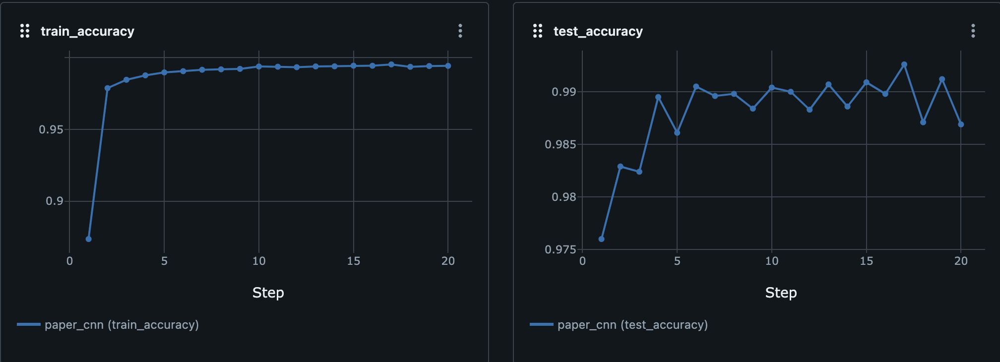

# Quanvolutional Neural Network
## About This Repository
This is the respository for one of the implementations of the Quanvolutional Neural Network (QNN) proposed in the scientific paper, Quanvolutional Neural Networks: Powering Image Recognition with Quantum Circuits. As far as I understand, the main focus of the original paper is to propose the general idea of a quantum version of convolutional layer rather than how to implement it. Although so, I implemented one realisation of this QNN structure mentioned in the original paper. That means the quanvolutional layer of this QNN is not trainable.

**PyTorch** and **Qiskit** are employed for the machine learning and quantum computing parts, respectively.

## Easy Summary
At the moment, the structure of the realisation is as follows.

1. quanvolutional layer
2. convolutional layer
3. pooling layer
4. convolutional layer
5. pooling layer
6. dense layer
7. dense layer (for output)

Only the first layer leverages the power of the quantum computing. There are plenty of information of the classical layers in the digital ocean. So, only the quantum part will be seen in this document.

The quanvolutional layer has got arbitrary number of the quantum filters, which are quantum circuits, as analogy to the classical convolutional layer. Each quantum filter, i.e., quantum circuit, is built randomly. There is set of quantum gates and some gates in the set are chosen when the quantum filter is created.

As same as the classical convolutional layer, the subsections of the input image are fed to the quanvolutional layer. The subsection data is encoded to the qubits of each quantum filter and processed. The results of the execution of each quantum filter are decoded to a scalar. Trivially, the number of outputs are the same as the number of quantum filters. In the end of applying the quanvolutional layer, the output feature maps are obtained.

Trivially, there would be infinite ways of encoding and decoding methods, yet the following methods are employed.

- Encoding: If the pixel value is greater than 0, then it is encoded to $\ket{1}$, otherwise $\ket{0}$.
- Decoding: The number of 1's in the most likely outcome is Summed.

Generally speaking, unfortunately, it still takes a large amount of time to execute quantum circuit. So, I employed the look-up table technique used in the original paper as well. This is quite simple. The quanvolutional layer prepares look-up tables between the inputs and outputs of every each quantum filter in advance instead of running each quantum filter every single time. Although it depends on the kernel size, which is the number of qubits, this drastically reduces the execution time.

Also, as the quanvolutional layer is not trainable and is the top layer, the quanvolutional layer may be regarded as a preprocess.

## Experiment Result
### MNIST
The following graphs are logged during the training by MLflow Tracking. "Step" implies epoch.

|  | loss graph | accuracy graph |
| --- | --- | --- |
| QNN |  |  |
| CNN |  |  |

Each value when the training was finished is as follows.

| | train_crossentropy | train_accuracy | test_crossentropy | test_accuracy |
| --- | --- | --- | --- | --- |
| QNN | 1.501229904053059 | 0.9604833333333334 | 1.4927423000335693 | 0.9706 |
| CNN | 1.4678614017811227 | 0.9941833333333333 | 1.473890781402588 | 0.9869 |

The following graph shows the test accuracies between the QuanvNN and the ClassicalCNN.

I know the accuracies are different from the above table. I have not checked this hypothesis, yet I reckon that is because `test_accuracy` is calculated according to the given batch size, which is 256 in that case, meanwhile the graph is drawn by `./scripts/get_accuracy_graph.py` using the batch size as a whole dataset size, which is 10000. 10000 is definately unable to be divided by 256, so some data is probably duplicated during calculating the accuracies.

We cannot observe the advantage of QNN here.